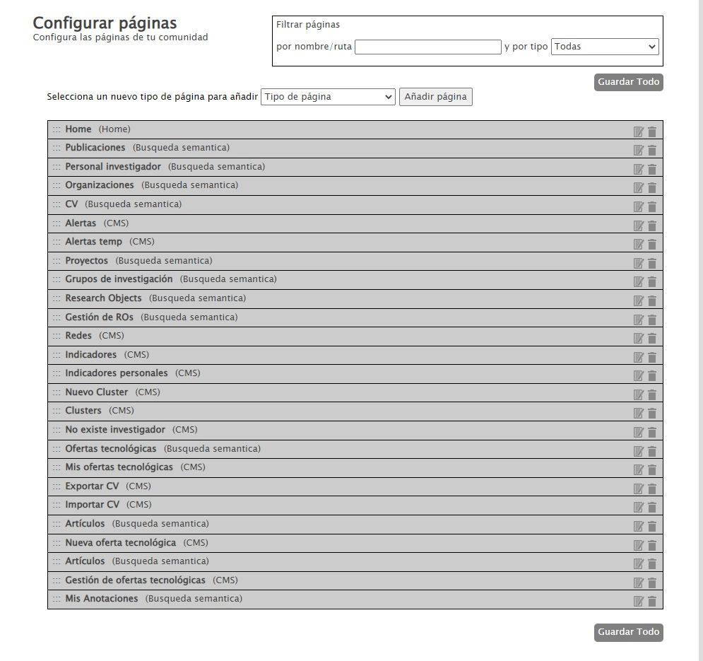
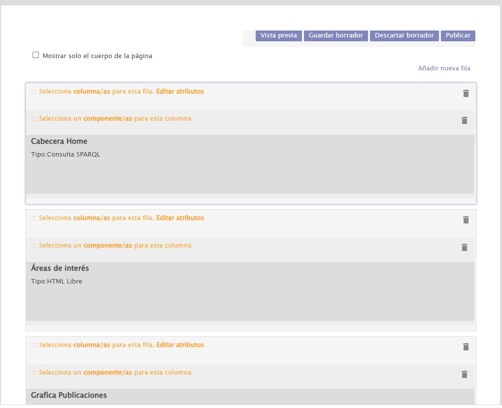

| Fecha                 | 05/09/2022                                |
| --------------------- | ---------------------------------------- |
| Título                | Configuración de páginas                 |
| Descripción           | Guía de funcionamiento de las páginas de búsqueda y CMS |
| Versión               | 1.0                                      |
| Módulo                | Documentación                            |
| Tipo                  | Especificación                           |
| Cambios de la Versión | Versión inicial                          |

# Configuración de páginas

 - [Introducción](#introducción)
 - [CMS](#cms)
   - [Configuración](#configuración)
 - [Páginas de búsqueda](#páginas-de-búsqueda)
   - [Componentes](#aa)
   - [Configuración de la página](#aa)
   - [Configuración de las facetas](#aa)
   - [Configuración del parámetro de búsqueda](#aa)

## Introducción
En esta documentación se explican las nociones de configuración de las páginas generales usadas en EDMA, en particular páginas del CMS y buscadores.  
Para acceder a la administración de páginas hay que acceder con el usuario administrador a la URL {URL_COMUNIDAD}/administrar-paginas

Dentro de esta página se pueden crear/editar/eliminar las páginas del CMS y los búscadores de la comunidad.  

### CMS

Las páginas del CMS son páginas personalizadas en las que presentar información como la home {URL_COMUNIDAD}/home o la página de indicadores {URL_COMUNIDAD}/indicadores.

#### Configuración

Las páginas del CMS se pueden estructurar en fila y columnas y dentro de ellas se pueden añadir componentes

Dentro de este proyecto se han utilizazo 3 tipos de componentes (se pueden ver en {URL_COMUNIDAD}/administrar-comunidad-cms-listado-componentes):  
 - HTML Libre: Sirven para representar un HTML simple.  
 - Consulta SPARQL: Sirven para recuperar datos de la BBDD sparql y representar los datos.
 - Destacado: En este proyecto se han utilizado como los componentes HTML Libre pero personalizando la vista con el HTML.

### Páginas de búsqueda

Las páginas de búsqueda sirven para crear un sistema de interrogación desde el que poder refinar las búsquedas.

de Los buscadores son un tipo de página que muestra un determinado sistema de interrogación.  
Estos buscadores están compuestos por el servicio de facetas y el servicio de resultados.  
//TODO imagen

## Gestionar Buscadores

### Pagina
- Nombre: Nombre de de la pagina, aparece como cabezera debajo de la caja de busqueda.
- Ruta: Direccion en la que se encontrara la pagina en la url (sin el domino).
- Filtro de orden: Lista con los filtros que aplicaran orden a los elementos de la pagina.
- 
### Aspecto de la minificha.
El comportamiento del buscador esta definido en las vistas /Views/Views/CargadorResultados/_ResultadoRecurso.cshtml y /Views/Views/CargadorResultados/CargarResultados.cshtml
En la vista _ResultadoRecurso.cshtml se define el aspecto que tendra la minificha, basandose en las propiedades del objeto de conocimiento.
### Objeto de conocimiento.
Los objetos de conocimiento definen la informacion que aparecera en la minificha.

Ajustes mas relevantes:
- Nombre: Nombre del objeto de conocimiento
- Namespace: Nombre de la ontologia 
- Lista de Propiedades: Las propiedades que se quiere que aparezcan en la ficha o usadas en las facetas.

## Facetas 
Las facetas son filtros que se aplican a los resultados. Aparecen a la izquierda de los resultados.
Las facetas estan definidas en Administración semántica > Facetas

Ajustes mas relevantes:
- Nombre de la faceta
- Tipo de faceta: Indica el tipo de informacion que representa la faceta (Texto, Fecha, Numero, Tesauro, Siglo, Texto Invariable)
- Objectos de conocimiento en los que va a aparecer: Aqui se indica el objeto de conocimiento del buscador

## Metabuscador
