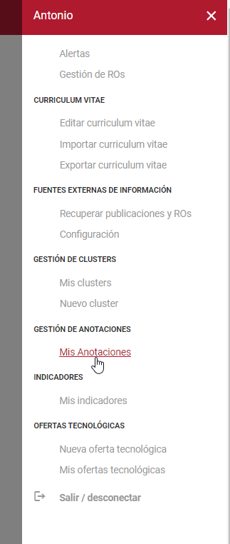
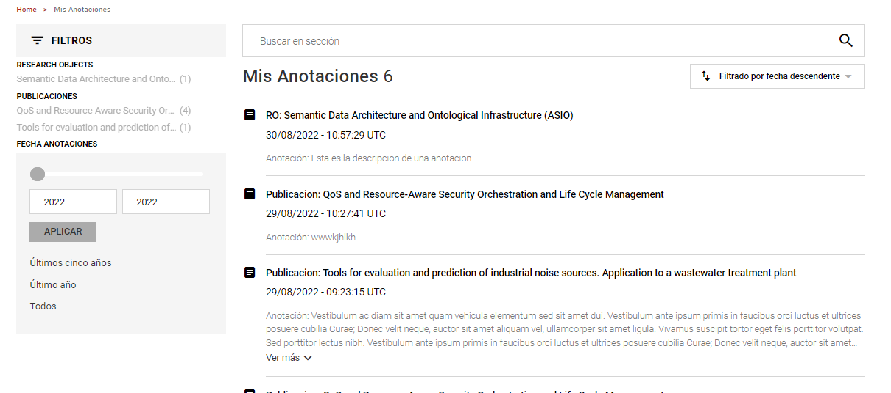
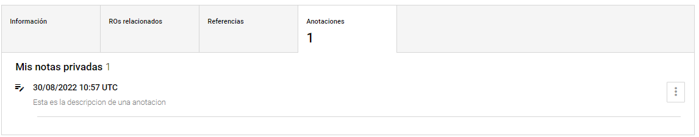
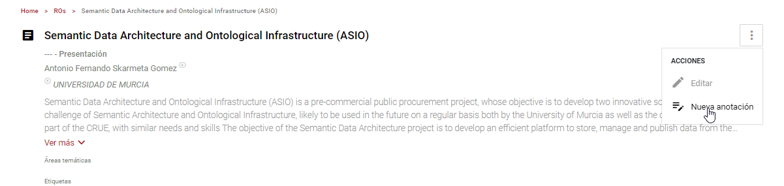
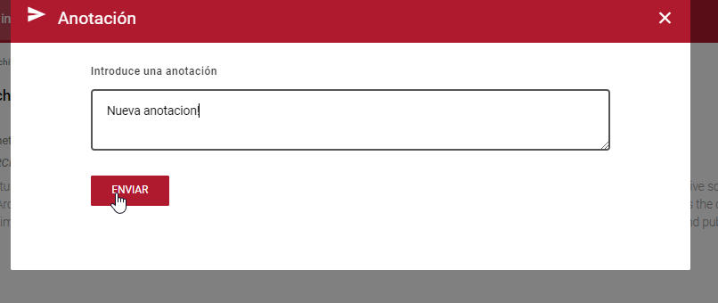

| Fecha                 | 29/8/2022                                 |
| --------------------- | ----------------------------------------- |
| Título                | Funcionamiento de las Anotaciones         |
| Descripción           | Guía de funcionamiento de las Anotaciones |
| Versión               | 1.0                                       |
| Módulo                | Documentación                             |
| Tipo                  | Especificación                            |
| Cambios de la Versión | Versión inicial                           |

# Funcionamiento de las Anotaciones

## Descripción
Las anotaciones son notas privadas que los usuarios pueden crear en Publicaciones y Research Objects. Al ser privadas y al ser creadas en una publicacion o RO, las anotaciones estan asocidadas con un usuario y una publicacion o RO.
### Información ontológica
Las anotaciones hacen referencia al objeto de conocimiento de las anotaciones (annotation.owl).
### Resumen funcional
Las anotaciones no poseen un listado público, pero si un listado de tus anotaciones personales, y una pestaña en las publicaciones y ROs en donde se pueden editar y eliminar, ademas de poderse crear en la pagina de la publicacion o RO.

## Buscador de mis anotaciones
Existe un listado en una pagina de busqueda de las anotaciones privadas del usuario, para acceder a él hay que ir al menú lateral derecho > "Gestión de Anotaciones" > "Mis Anotaciones" 

Para acceder a la página de 'Mis anotaciones' hay que estar logueado y únicamente se mostrarán las anotaciones que tú has creado.
### Resumen funcional
El listado de anotaciones contiene un listado simple de las anotaciones en el que se muestra el texto de la anotacion, la fecha en la que se creo y el titulo de la publicacion o RO en la que se encuentra, ademas de un enlace a la publicacion o RO.

### Datos del Buscador
El listado de las anotaciones es una página de busqueda llamada 'Mis Anotaciones', no tiene vista propia pero tiene una seccion en la vista de los resultados del buscador, donde se indica que se debe pintar el titulo de la publicacion, la fecha y la anotacion. La vista se encuentra en /Views/Views/CargadorResultados/_ResultadoRecurso.cshtml

- RdfType - annotation
- Facetas:
	- Fecha anotaciones: Muestra solo las anotaciones entre un rango de años.
	- Publicaciones: Muestra solo las anotaciones de la publicacion seleccionada.
	- Research Objects: Muestas solo las anotaciones del Research Object seleccionado.
- Búsqueda personalizada - searcherAnnotations

## Listado de mis anotaciones en una Publicacion o RO
Al acceder como usuario loggeado a una publicacion o RO aparecera una pestaña nueva, Mis Anotaciones, donde se muestran las anotaciones que ese usuario tiene sobre esa publicacion o RO. Si el usuario no tiene anotaciones, aparece un mensaje informandole que no hay.

### Resumen funcional
Para acceder a esta pestaña se tiene que acceder antes a una publicacion o RO, y debajo de la descripcion y etiquetas, en la sección con pestañas, aparece la pestaña de anotaciones.

### Resumen del desarrollo
La lógica javascript se encuentra en el archivo annotation.js y en las vistas de publicacion y ROs.
Se realizan llamadas a los diferentes servicios para las diferentes funcionalidades, la lista de llamadas son las siguientes:

- Carga de Anotaciones Existentes:
	- **API:** ServicioExterno
	- **Controlador:** AnotationController
	- **Función:** [POST]GetOwnAnnotationsInRO

## Creación de una anotacion
Para la creación de una anotacion, debes de estar loguedado como personal investigador.

### Resumen funcional
Se debe acceder a una publicacion o RO, despues en la esquina superior derecha hay un menú desplegable de acciones, una de esas acciones se llama "Nueva Anotación", al pincharla se abre un modal donde puedes introducir el texto de tu anotación y un boton de enviar que la guarda.

### Resumen del desarrollo

- Creacion de la anotacion:
	 - **API:** ServicioExterno
	- **Controlador:** AnotationController
	 - **Función:** [POST]CreateNewAnnotation

## Edición de una Anotacion
La edición de una anotación se realiza en la pestaña de anotaciones de una publicacion o RO.

A la derecha de la anotación hay un menu expandible de acciones, una de las acciones es editar anotacion, al pincharla se abre un modal con el texto de la anotación que le permite al usuario editarlo.

### Resumen del desarrollo
Toda la lógica de la edición de una anotación y la de la creación de la misma es igual, unicamente el guardado tiene un parametro mas, el id de la anotación existente.

- Guardado de la anotación (Igual que en la creación de la anotacion, pero con un parámetro más):
    - **API:** ServicioExterno
	- **Controlador:** AnotationController
	 - **Función:** [POST]CreateNewAnnotation

## Borrado de una Anotacion
El Borrado de una anotación se realiza en la pestaña de anotaciones de una publicacion o RO.

A la derecha de la anotación hay un menu expandible de acciones, una de las acciones es borrar anotacion, al pincharla se elimina la anotacion.

### Resumen del desarrollo
Se realizan llamadas a los diferentes servicios para las diferentes funcionalidades, la lista de llamadas son las siguientes: 

- Borrado de la anotacion:
    - **API:** ServicioExterno
	- **Controlador:** AnotationController
	 - **Función:** [POST]DeleteAnnotation

## Permisos
Los permisos para la edición, creación y borrado de las anotaciones requieren ser un usuario registrado.
- Creación: Únicamente un usuario logueado.
- Edición: El usuario creador de la anotacion.
- Borrado: El usuario creador de la anotacion.
- Listado: El usuario creador de las anotaciones.
