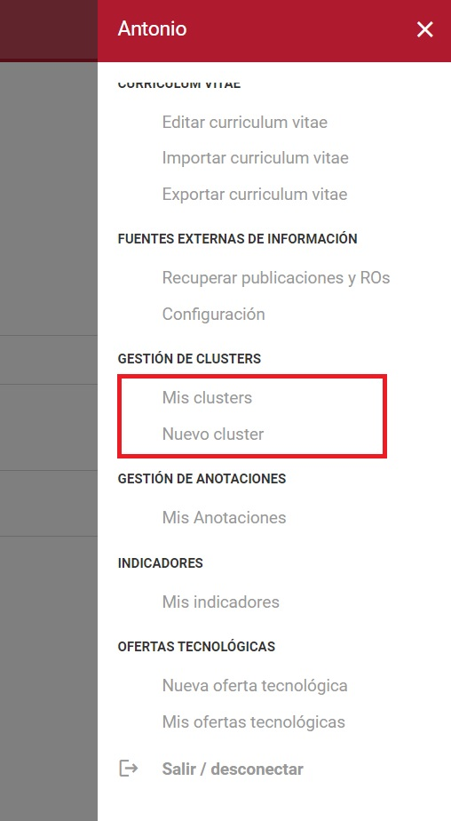
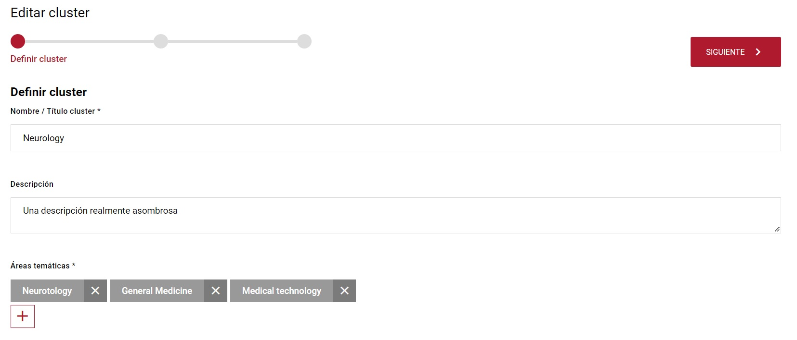
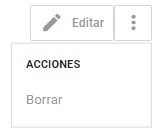
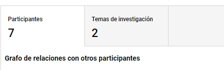

| Fecha         | 29/8/2022                                                   |
| ------------- | ------------------------------------------------------------ |
|Título|Funcionamiento de los Cluster|
|Descripción|Guía de funcionamiento de los cluster|
|Versión|1.0|
|Módulo|Documentación|
|Tipo|Especificación|
|Cambios de la Versión|Versión inicial|

# Funcionamiento de los Cluster

## Descripción
Los clusters son conjuntos de investigadores asociados a perfiles de investigación que los diferentes usuarios de la web crean para poder guardar y disponer información sobre potenciales equipos de desarrollo.
### Información ontológica
Los cluster hacen referencia al objeto de conocimiento de los Cluster (cluster.owl).
### Resumen funcional
Los cluster no poseen un listado público, pero si una página para la creación de cluster, otra para la edición de los mismos y un listado de tus clusters.

## Listado general de los cluster
No existe un listado general de los cluster, únicamente existe un listado de mis clusters

## Listado de mis cluster
Existe un listado simple de "Mis clusters", para acceder a él hay que ir al menú lateral derecho > "Gestión de clusters" > "Mis clusters" 

Para acceder a la página de 'Mis clusters' hay que estar logueado y únicamente se mostrarán los clusters que tú has creado.
 

### Resumen funcional
El listado de clusters contiene un listado simple de los clusters y un listado de los investigadores por cada perfil de investigador. Así mismo dispone de un enlace a la ficha de los clusters de investigación y un botón de edición al mismo. El enlace de editar enlaza a la página de creación del cluster pasándole como parámetro el id del mismo.

### Datos del gestor
El listado de los clusters es una página del cms llamada 'Cluster'
La vista de creación del cluster se encuentra '[\_ConsultaSPARQL_listadocluster$$$addf4aca-9147-4946-8f9b-d23fb07719a2.cshtml](https://github.com/HerculesCRUE/Commons-ED-MA/blob/main/Web/Views/CMS/ConsultaSPARQL/_ConsultaSPARQL_listadocluster$$$addf4aca-9147-4946-8f9b-d23fb07719a2.cshtml)'. La vista de personalización en el gestor de GNOSS se encuentra en 'Plantillas de los componentes del CMS/Consulta SPARQL/Listado_Cluster'

## Creación del cluster
Para la creación del cluster, debes de estar loguedado como personal investigador y acceder al menú lateral derecho > "Gestión de clusters" > "Nuevo Cluster".
### Resumen funcional
La creación de un cluster consiste en un formaulario de varios pasos (o Stepper), y dispone de las siguientes funcionalidades:
- **Step 1** (Definir cluster): Contiene los campos de 
	- Nombre (Obligatorio)
	- Descripción
	- Áreas temáticas (Obligatorio)
- **Step 2** (Definir perfiles y áreas de investigación): En este paso se definirán los diferentes perfiles y áreas de investigación encargados del filtro y segmentación posterior de los investigadores que vayan a ser parte del cluster. Se podrán añadir tantos perfiles como se quiera, y cada perfil constará de un número indeterminado de áreas temáticas y de al menos un descriptor específico.
- **Step 3** (Recomendaciones y selección de investigadores): Nos encontramos en la pantalla donde se eligen los investigadores que corresponden con los perfiles de investigación. En esta pantalla se realiza una llamada a 'buscadorPersonalizado' (ficharecurso.js), con las búsquedas personalizadas 'searchClusterMixto', 'searchClusterAjuste' y 'searchClusterVolumen' dependiendo del orden seleccionado. En el buscador se seleccionarán los perfiles a los que se quiere que pertenezcan los diferentes investigadores. También aparecerán gráficas mostrando las relaciones entre los investigadores, y una segunda pestaña mostrando los investigadores seleccionados segmentados por los diferentes perfiles seleccionados anteriormente.

### Datos del gestor
La creación de los clusters es una página del cms llamada 'Nuevo Cluster'
La vista de creación del cluster se encuentra '[\_Destacado_creacioncluster$$$f69da06a-9211-4722-abb6-a70bffb0a41e.cshtml](https://github.com/HerculesCRUE/Commons-ED-MA/blob/main/Web/Views/CMS/Destacado/_Destacado_creacioncluster$$$f69da06a-9211-4722-abb6-a70bffb0a41e.cshtml)'. La vista de personalización en el gestor de GNOSS se encuentra en 'Plantillas de los componentes del CMS/Destacado/CreacionCluster'

### Resumen del desarrollo
La lógica javascript se encuentra en el archivo [cluster.js](https://github.com/HerculesCRUE/Commons-ED-MA/blob/main/Web/Estilos/theme/cluster.js)
Se realizan llamadas a los diferentes servicios para las diferentes funcionalidades, la lista de llamadas son las siguientes:
- Carga de taxonomías `Áreas temáticas`:
	- **API:** [ServicioExterno](https://github.com/HerculesCRUE/Commons-ED-MA/blob/main/src/Hercules.CommonsEDMA.ServicioExterno)
	- **Controlador:** ClusterController
	- **Función:** [GET]GetThesaurus
- Carga de los `Descriptores específicos`:
	- **API:** [ServicioExterno](https://github.com/HerculesCRUE/Commons-ED-MA/blob/main/src/Hercules.CommonsEDMA.ServicioExterno)
	- **Controlador:** ClusterController
	- **Función:** [GET]SearchTags
- Gráfica de las relaciones entre los investigadores:
	- **API:** [ServicioExterno](https://github.com/HerculesCRUE/Commons-ED-MA/blob/main/src/Hercules.CommonsEDMA.ServicioExterno)
	- **Controlador:** ClusterController
	- **Función:** [POST]DatosGraficaColaboradoresCluster
- Carga de los perfiles de investigación creados:
	- **API:** [ServicioExterno](https://github.com/HerculesCRUE/Commons-ED-MA/blob/main/src/Hercules.CommonsEDMA.ServicioExterno)
	- **Controlador:** ClusterController
	- **Función:** [GET]LoadSavedProfiles
- Carga de los perfiles de investigación y el porcentaje de acierto en cada usuario sugerido:
	- **API:** [ServicioExterno](https://github.com/HerculesCRUE/Commons-ED-MA/blob/main/src/Hercules.CommonsEDMA.ServicioExterno)
	- **Controlador:** ClusterController
	- **Función:** [POST]LoadProfiles
- Creación del cluster:
	- **API:** [ServicioExterno](https://github.com/HerculesCRUE/Commons-ED-MA/blob/main/src/Hercules.CommonsEDMA.ServicioExterno)
	- **Controlador:** ClusterController
	- **Función:** [POST]SaveCluster

## Edición del cluster
La edición del cluster se realiza en la misma págína que la creación del mismo, únicamente que se le pasa un parámetro indicando el id del mismo.
 

Para acceder a la edición del mimo, se puede acceder desde la página del listado de los clusters o desde la ficha del mismo.

### Resumen del desarrollo
Toda la lógica de edición del cluster y la de la creación del mismo es igual, únicamente se carga el contenido del cluster si se le pasa el id como parámetro, y se llama a la API para obtener los datos necesarios para precargar los datos. Las llamadas a la API que no se encuentran en la creación del mismo son las siguientes:
- Carga del cluster:
	- **API:** [ServicioExterno](https://github.com/HerculesCRUE/Commons-ED-MA/blob/main/src/Hercules.CommonsEDMA.ServicioExterno)
	- **Controlador:** ClusterController
	- **Función:** [GET]LoadCluster
- Guardado del cluster (Igual que en la creación del cluster, pero con un parámetro más):
	- **API:** [ServicioExterno](https://github.com/HerculesCRUE/Commons-ED-MA/blob/main/src/Hercules.CommonsEDMA.ServicioExterno)
	- **Controlador:** ClusterController
	- **Función:** [POST]SaveCluster

## Ficha del cluster
Se accede desde el listado de los clusters o desde la creación/edición de los mismos una vez que se han guardado los cambios.
### Resumen funcional
En esta pantalla nos encontramos con las funciones típicas de las fichas de los diferentes contenidos; nos encontramos con el título, la fecha de creación de la página, la descripción del mismo y las areas temáticas.
Respecto al menú de acciones, nos encontramos con los siguientes enlaces:
- **Edición**: Botón que otorga la posibilidad de editar el cluster (un enlace), que lleva a la página edición (creación) de clusters, junto a un parámetro con el id del recurso para la carga y edición del mismo.
- **Borrar**: Botón que permite borrar el recurso, para evitar accidentes, saldrá un mensaje para confirmar la acción.
 

**Datos enriquecidos:**
- **Participantes**: Pestaña con una gráfica de las relaciones de los participantes elegidos para el cluster y un listado del personal investigador seleccionado indicando a qué perfil se ha añadido.
- **Temas de investigación**: Gráfica que pone de relieve los Áreas de investigación que más se repiten en la publicación científica de los investigadores seleccionados.
 

### Resumen del desarrollo
Archivo: 'Views/Recursos/cluster.cshtml'.
Javascript: El js mayormento se encuentra en el propio archivo de la ficha.
Los métodos usados en el editor son los siguientes:
- Grafo de relaciones con otros participantes:
	- **API:** [ServicioExterno](https://github.com/HerculesCRUE/Commons-ED-MA/blob/main/src/Hercules.CommonsEDMA.ServicioExterno)
	- **Controlador:** ClusterController
	- **Función:** [POST]DatosGraficaColaboradoresCluster
- Gráfica de la distribución de los principales temas de investigación:
	- **API:** [ServicioExterno](https://github.com/HerculesCRUE/Commons-ED-MA/blob/main/src/Hercules.CommonsEDMA.ServicioExterno)
	- **Controlador:** ClusterController
	- **Función:** [POST]DatosGraficaAreasTematicasCluster
- Borrar:
	- **API:** [ServicioExterno](https://github.com/HerculesCRUE/Commons-ED-MA/blob/main/src/Hercules.CommonsEDMA.ServicioExterno)
	- **Controlador:** ClusterController
	- **Función:** [POST]BorrarCluster

### Datos del gestor
La ficha del cluster es el recurso llamado 'cluster'
La vista de la ficha del cluster se encuentra '[cluster.cshtml](https://github.com/HerculesCRUE/Commons-ED-MA/blob/main/Web/Views/Recursos/cluster.cshtml)'. La vista de personalización en el gestor de GNOSS se encuentra en 'Plantillas de la web/cluster'

## Permisos
Los permisos para la edición, creación y borrado de los clusters requieren ser un usuario registrado.
- Creación: Únicamente un usuario logueado
- Edición: El usuario creador del cluster
- Listado: El usuario creador de los clusters
- Ficha: El usuario creador del cluster

