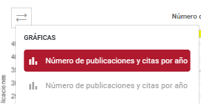
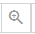
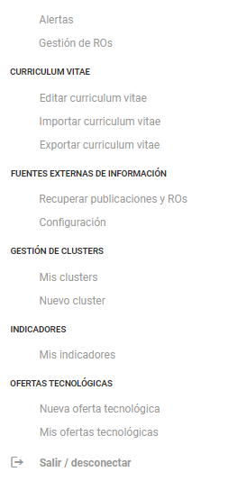
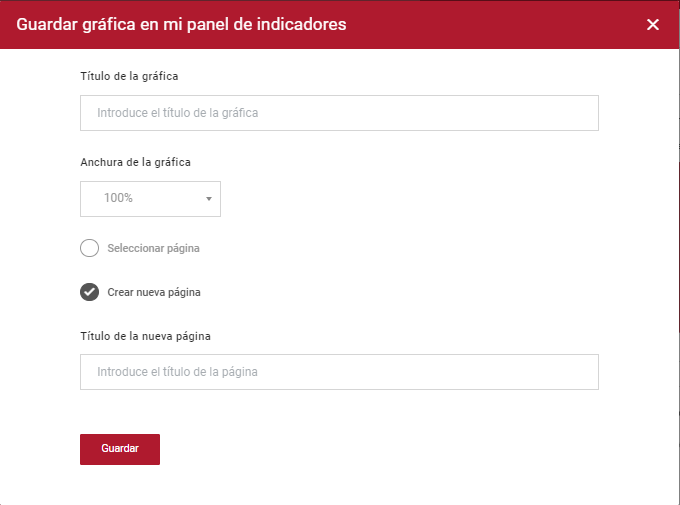
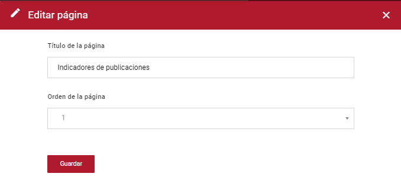
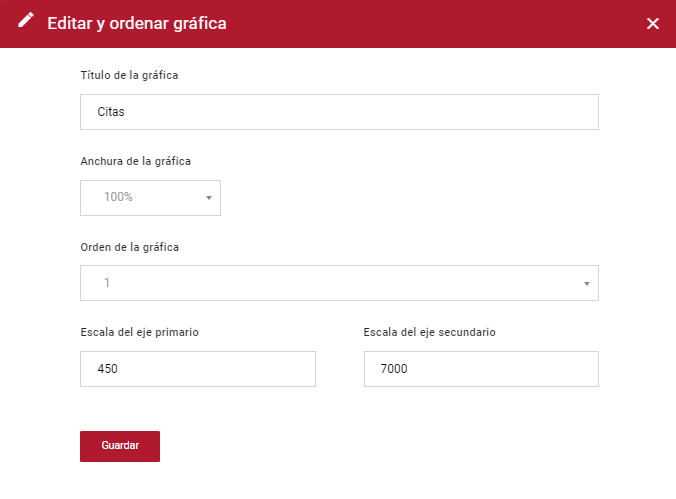

| Fecha         | 05/9/2022                                                   |
| ------------- | ------------------------------------------------------------ |
|Título|Funcionamiento de los Indicadores|
|Descripción|Guía de funcionamiento de los indicadores|
|Versión|1.0|
|Módulo|Documentación|
|Tipo|Especificación|
|Cambios de la Versión|Versión inicial|

# Funcionamiento de los Indicadores

## Introducción
En este documento se describirá el funcionamiento de las gráficas de indicadores de Hércules MA y se explicarán los distintos controladores, vistas y la lógica que es utilizada.

### Información ontológica
Los indicadores personales pertenecen a la ontología de persona (person.owl), y en concreto a la entidad secundaria MetricPage.

### Resumen funcional
Existen indicadores de dos tipos, los generales o públicos para todos los usuarios y los personales, que son los que los usuarios logeados pueden almacenar en su página propia de indicadores y hacer modificaciones a las gráficas como cambiar título, tamaño, escala, etc.

## Funcionamiento de los indicadores
Aquí se detallará la vista, el js y los controladores que se utilizan para el funcionamiento de los indicadores.
### Archivos de las vistas
Se utilizan dos vistas, una para los indicadores generales y otra para los indicadores personales.
- Indicadores generales: Es la vista 'Metricas' del CMS destacado.
- Indicadores personales: Es la vista 'Indicadores personalizados' del CMS destacado.
### Archivos de JavaScript
Ambos indicadores utilizan el archivo de JS "Estilos/theme/graphic-engine.js" en el que se consume otro archivo JS "Estilos/theme/graficas_proy.js".
Este último archivo funciona como librería para generar gráficas en Hércules, y utiliza las librerías de Chart.js y cytoscape.js para crear los distintos tipos de gráficas.
### Controladores
Ambos indicadores consumen el mismo controlador. Ahora se repasarán las distintas peticiones que se realizan al controlador.
- Obtención del objeto de la gráfica y sus datos:
	- **API:** [GraphicEngine](https://github.com/HerculesCRUE/HerculesMA/blob/main/src/Hercules.MA.GraphicEngine)
	- **Controlador:** GraphicControllers
	- **Función:** [GET]GetGrafica
- Obtención de una lista de gráficas y sus datos específicos del usuario:
	- **API:** [GraphicEngine](https://github.com/HerculesCRUE/HerculesMA/blob/main/src/Hercules.MA.GraphicEngine)
	- **Controlador:** GraphicControllers
	- **Función:** [GET]GetGraficasUser
- Crea una nueva página de indicadores personales:
	- **API:** [GraphicEngine](https://github.com/HerculesCRUE/HerculesMA/blob/main/src/Hercules.MA.GraphicEngine)
	- **Controlador:** GraphicControllers
	- **Función:** [GET]CrearPagina
- Crea un documento CSV de una gráfica:
	- **API:** [GraphicEngine](https://github.com/HerculesCRUE/HerculesMA/blob/main/src/Hercules.MA.GraphicEngine)
	- **Controlador:** GraphicControllers
	- **Función:** [GET]GetCSVGrafica
- Obtención de las facetas o filtros de la página:
	- **API:** [GraphicEngine](https://github.com/HerculesCRUE/HerculesMA/blob/main/src/Hercules.MA.GraphicEngine)
	- **Controlador:** GraphicControllers
	- **Función:** [GET]GetFaceta
- Obtiene las páginas de indicadores generales:
	- **API:** [GraphicEngine](https://github.com/HerculesCRUE/HerculesMA/blob/main/src/Hercules.MA.GraphicEngine)
	- **Controlador:** GraphicControllers
	- **Función:** [GET]GetPaginasGraficas
- Comprueba si el usuario es administrador de gráficas o no:
	- **API:** [GraphicEngine](https://github.com/HerculesCRUE/HerculesMA/blob/main/src/Hercules.MA.GraphicEngine)
	- **Controlador:** GraphicControllers
	- **Función:** [GET]IsAdmin
- Obtiene las configuraciones de las páginas:
	- **API:** [GraphicEngine](https://github.com/HerculesCRUE/HerculesMA/blob/main/src/Hercules.MA.GraphicEngine)
	- **Controlador:** GraphicControllers
	- **Función:** [GET]ObtenerConfigs
- Devuelve un archivo de configuración concreto para su descarga:
	- **API:** [GraphicEngine](https://github.com/HerculesCRUE/HerculesMA/blob/main/src/Hercules.MA.GraphicEngine)
	- **Controlador:** GraphicControllers
	- **Función:** [GET]DescargarConfig
- Actualiza un archivo de configuración concreto:
	- **API:** [GraphicEngine](https://github.com/HerculesCRUE/HerculesMA/blob/main/src/Hercules.MA.GraphicEngine)
	- **Controlador:** GraphicControllers
	- **Función:** [POST]SubirConfig
- Edita la configuración de una gráfica de indicadores generales:
	- **API:** [GraphicEngine](https://github.com/HerculesCRUE/HerculesMA/blob/main/src/Hercules.MA.GraphicEngine)
	- **Controlador:** GraphicControllers
	- **Función:** [GET]EditarConfig
- Obtiene la configuración de una gráfica de indicadores generales:
	- **API:** [GraphicEngine](https://github.com/HerculesCRUE/HerculesMA/blob/main/src/Hercules.MA.GraphicEngine)
	- **Controlador:** GraphicControllers
	- **Función:** [GET]ObtenerGraficaConfig
- Obtiene las páginas de indicadores personales de un usuario específico:
	- **API:** [GraphicEngine](https://github.com/HerculesCRUE/HerculesMA/blob/main/src/Hercules.MA.GraphicEngine)
	- **Controlador:** GraphicControllers
	- **Función:** [GET]GetPaginasUsuario
- Guarda una gráfica de indicadores generales en el panel de indicadores personales del usuario:
	- **API:** [GraphicEngine](https://github.com/HerculesCRUE/HerculesMA/blob/main/src/Hercules.MA.GraphicEngine)
	- **Controlador:** GraphicControllers
	- **Función:** [GET]GuardarGrafica
- Borra la gráfica de indicadores personales del usuario:
	- **API:** [GraphicEngine](https://github.com/HerculesCRUE/HerculesMA/blob/main/src/Hercules.MA.GraphicEngine)
	- **Controlador:** GraphicControllers
	- **Función:** [GET]BorrarGrafica
- Borra la página de indicadores personales del usuario:
	- **API:** [GraphicEngine](https://github.com/HerculesCRUE/HerculesMA/blob/main/src/Hercules.MA.GraphicEngine)
	- **Controlador:** GraphicControllers
	- **Función:** [GET]BorrarPagina
- Edita el nombre de la página de indicadores personales:
	- **API:** [GraphicEngine](https://github.com/HerculesCRUE/HerculesMA/blob/main/src/Hercules.MA.GraphicEngine)
	- **Controlador:** GraphicControllers
	- **Función:** [GET]EditarNombrePagina
- Edita el orden de la página de indicadores personales:
	- **API:** [GraphicEngine](https://github.com/HerculesCRUE/HerculesMA/blob/main/src/Hercules.MA.GraphicEngine)
	- **Controlador:** GraphicControllers
	- **Función:** [GET]EditarOrdenPagina
- Edita el nombre de la gráfica de indicadores personales:
	- **API:** [GraphicEngine](https://github.com/HerculesCRUE/HerculesMA/blob/main/src/Hercules.MA.GraphicEngine)
	- **Controlador:** GraphicControllers
	- **Función:** [GET]EditarNombreGrafica
- Edita el orden de la gráfica de indicadores personales:
	- **API:** [GraphicEngine](https://github.com/HerculesCRUE/HerculesMA/blob/main/src/Hercules.MA.GraphicEngine)
	- **Controlador:** GraphicControllers
	- **Función:** [GET]EditarOrdenGrafica
- Edita la anchura de la gráfica de indicadores personales:
	- **API:** [GraphicEngine](https://github.com/HerculesCRUE/HerculesMA/blob/main/src/Hercules.MA.GraphicEngine)
	- **Controlador:** GraphicControllers
	- **Función:** [GET]EditarAnchuraGrafica
- Edita las escalas/ejes de la gráfica de indicadores personales en función de si tiene 1 o 2 escalas:
	- **API:** [GraphicEngine](https://github.com/HerculesCRUE/HerculesMA/blob/main/src/Hercules.MA.GraphicEngine)
	- **Controlador:** GraphicControllers
	- **Función:** [GET]EditarEscalasGrafica

# Indicadores
Una vez que el usuario administrador haya configurado las gráficas, el resto de usuarios podrán verlas e interactuar con ellas desde la página de Indicadores.
En la parte superior se puede ver un menú de pestañas.

Y el botón que despliega las facetas.

Las graficas a su vez tiene distintos botones para interactuar:

- Desplegable (arriba a la izquierda): Está opción únicamente se mostra cuando en la gráfica esté agregada la configuración de idGrupo. Dicha opción mostrará un listado de gráficas para poder seleccionar la que se quiera visualizar.

- Expandir/Contraer (arriba a la derecha): Amplia / Disminuye la gráfica para la visualización de datos.

- Lupa (arriba a la derecha): Se abrirá un popup con la gráfica ampliada.

- Menú de acciones (arriba a la derecha):
  - Descargar JPG: Permite descargarse una imagen, en formtato JPG, de la gráfica completa.
  - Descargar CSV: Permite descargar los datos de la gráfica en formato CSV.
  - Guardar en mi panel: Permite al usuario guardarse la gráfica en ["Mis indicadores"](#indicadores-personales). 
  - Configuración: Abrirá un menú de configuracion de la gráfica para editar título, anchura de la gráfica y orden. Solo será visible a usuarios administradores en esta pestaña. 
  

## Ejemplo de guardado de gráficas
Los usuarios tienen una opción en su menú, llamada "Mis indicadores", en la que pueden guardar gráficas para su espacio personal. 

Para guardar una gráfica en el espacio personal hay que seguir los siguientes pasos:

- Situados en la página de Indicadores, pulsamos al botón de tres puntos de la gráfica a guardar y seleccionamos la opción de "Guardar en mi panel".

- Se nos abrirá un pop-up con una pequeña configuración de guardado:

  - Título de la gráfica: Título el cual se va a guardar la gráfica.
  - Anchura: Porcentaje de anchura de la gráfica.
  - Seleccionar página / Crear nueva página: Página en la cual se guardará la gráfica. En el caso de que no se tenga páginas creadas, únicamente aparecerá la segunda opción "Crear nueva página".
  
Una vez pulsado el botón guardar, se nos habrá generado la gráfica en el menú de "Mis indicadores".
Si nos dirigimos allí, la veremos tal y como la hayamos guardado, es decir, con filtros incluidos. 
También se habrá creado la página si lo hemos seleccionado.
 
## Indicadores Personales
La sección de indicadores personales permite al usuario, la interacción con gráficas de una manera más personal. Pudiendo modificar algunos aspectos de la misma, como la escala de los ejes, la anchura, titulo y orden. Permitiendo incluso generar un informe personalizado con las gráficas.

En el menú de la página se puede ver "Descargar", "Editar página" y "Borrar página".

Al pulsar sobre "Descargar", se generará un archivo PDF presentando todas las gráficas de una manera limpia.

Si pulsamos sobre "Editar página" se abrirá un popup, en el cual podemos cambiar el título de la página y el orden de la misma.

Pulsando "Borrar página" se nos mostrará un mensaje de borrado. Eliminando la página en el caso de aceptarlo.

En el apartado de las gráficas, si pulsamos el menú de acciones, representado por tres puntos, se abrirán opciones adicionales.

  - Descargar JPG - Descargará una imagen JPG de la gráfica.
 
  - Descargar CSV - Descargará un archivo CSV con los datos de la gráfica.
 
  - Editar y ordenar gráfica - Abrirá un popup con las siguientes opciones de edición:
    - Título de la gráfica: Permite modificar el título de la gráfica.
    - Anchura de la gráfica: Permite cambiar el ancho de la gráfica.
    - Orden de la gráfica: Mueve la gráfica a la posición seleccionada.
    - Escala del eje primario: Establece la altura maxima del eje primario.
    - Escala del eje secundario: Establece la altura maxima del eje secundario.
  

  
  
  - Eliminar gráfica - Abrirá un popup, similar al de "Borrar página", para confirmar el borrado de la gráfica.
  

