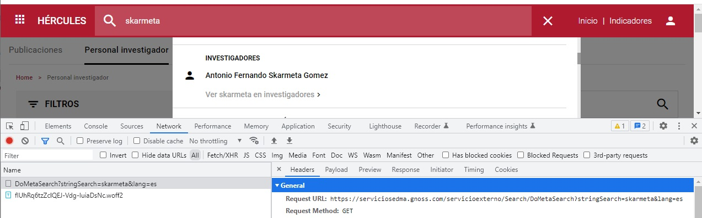

| Fecha                 | 05/09/2022                               |
| --------------------- | ---------------------------------------- |
| Título                | Metabuscador                             |
| Descripción           | Guía de funcionamiento del metabuscador  |
| Versión               | 1.0                                      |
| Módulo                | Documentación                            |
| Tipo                  | Especificación                           |
| Cambios de la Versión | Versión inicial                          |

# Metabuscador

 - [Introducción](#introducción)
 - [Componentes](#componentes)
 - [Flujo](#flujo)

## Introducción
En esta documentación se explica el funcinoamiento del metabuscador que se encuetra en la cabecera de las páginas.  
Este metabuscador realiza búsquedas dentro de las páginas púbicas de MA:
 - Publicaciones
 - Personal investigador
 - Proyectos
 - Grupos de investigación
 - Research Objects
 - Ofertas tecnológicas

## Componentes
Los componentes involucrados en el metabuscador son los siguientes:
 - Javascript: El comportamiento javascript está dentro del fichero [community_proy.js](https://github.com/HerculesCRUE/HerculesED/blob/main/Web/Estilos/theme/community_proy.js) y para lanzarlo se ejecuta metabuscador.init
 - Servicio externo: Es el [servicio](https://github.com/HerculesCRUE/HerculesMA/tree/main/src/Hercules.MA.ServicioExterno) que se utiliza para devolver los resultados del metabuscador 

## Flujo
 - Al arrancar el servicio externo se ejecuta el método 'GenerateMetaShearch' dentro de la clase 'AccionesMetaBusqueda' que se encarga de cargar los datos para que posteriormente estén disponibls en las búsquedas. Carga en el objeto AccionesMetaBusqueda.textSearch todasl las palabras que aparecen en los elementos buscables asociados a la propiedad, a un peso y al objeto en el que aparecen (Este proceso se repite cada 5 minutos).
 - Al cargar cualquier página se ejecuta metabuscador.init() que prepara el funcionamiento del metabuscador
 - En el evento 'keyup' del input del metabuscador se desencadena una llamada al controlador 'Search' del metabuscador en el método 'DoMetaSearch' pasando como parámetros 'stringSearch' con el texto que hay dentro del input y el parametro 'lang' con el idioma de navegación.
 
 - Una vez llega la petición al servicio se realizan las siguientes acciones:
   - Se limpia el texto (pasándolo todo a minúsculas y eliminando acentos) 
   - Se trocea el texto por espacios y se almacena en una variable las palabras a buscar completas y las palabra que hay que buscar sólo como inicio de un texto.
   - Se busca dentro de la variable AccionesMetaBusqueda.textSearch todas las propiedades que cumplen con los textos de entrada
   - Se monta el objeto de respuesta con los items obtenidos
   - En la respuesta se envía lo siguiente:
     - Un diccionario cuya clave es el tipo de recurso
     - Para cada una de las claves se envía si la búsqueda de la página ofrecería resultados (en la página de búsqueda sólo se busca por palabras completas) 
     - Un listado con los items de cada tipo que contiene el título y la URL
