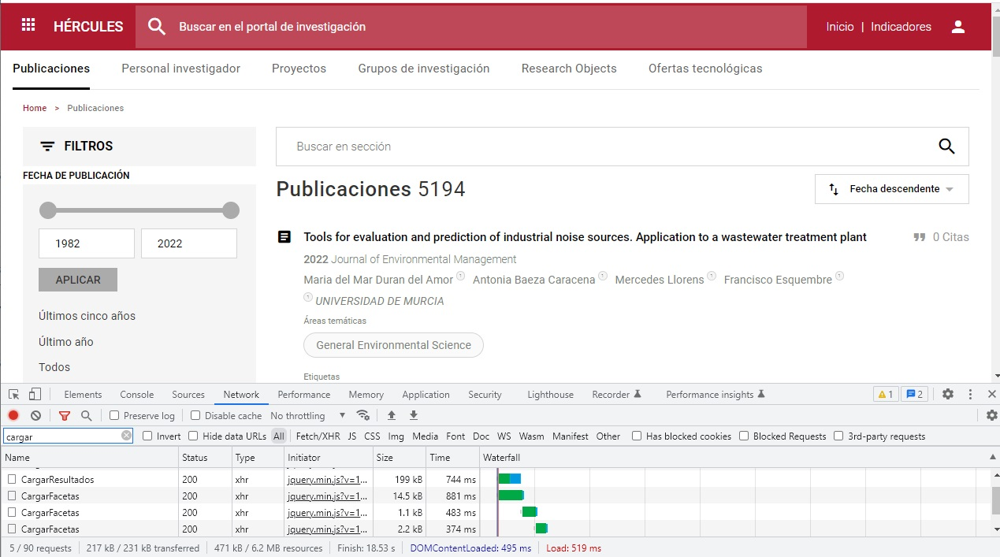
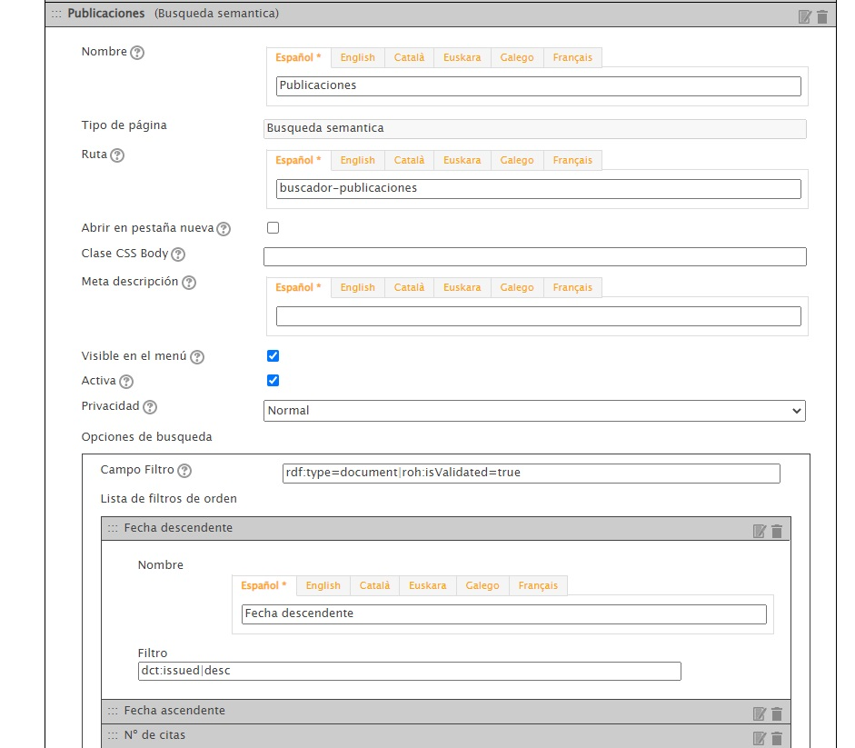
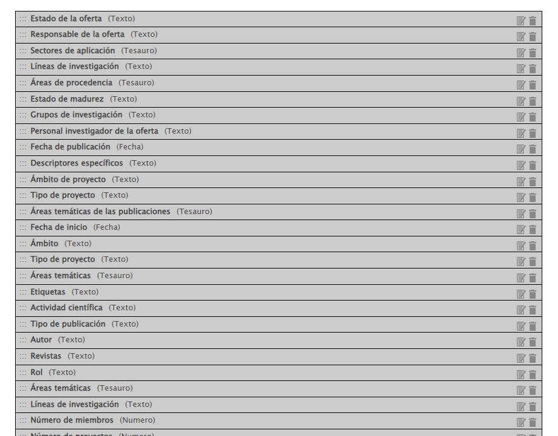
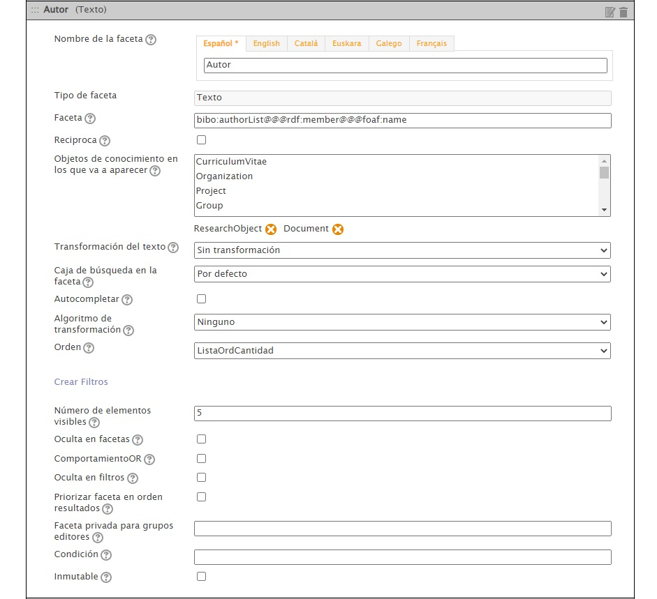

| Fecha                 | 05/09/2022                               |
| --------------------- | ---------------------------------------- |
| Título                | Metabuscador                             |
| Descripción           | Guía de funcionamiento del metabuscador  |
| Versión               | 1.0                                      |
| Módulo                | Documentación                            |
| Tipo                  | Especificación                           |
| Cambios de la Versión | Versión inicial                          |

# Metabuscador

 - [Introducción](#introducción)
 - [Componentes](#componentes)
 - [Flujo](#flujo)

## Introducción
En esta documentación se explica el funcinoamiento del metabuscador que se encuetra en la cabecera de las páginas.  
Este metabuscador realiza búsquedas dentro de las páginas púbicas de MA:
 - Publicaciones
 - Personal investigador
 - Proyectos
 - Grupos de investigación
 - Research Objects
 - Ofertas tecnológicas

## Componentes
Los componentes involucrados en el metabuscador son los siguientes:
 - Javascript: El comportamiento javascript está dentro del fichero [community_proy.js](https://github.com/HerculesCRUE/HerculesED/blob/main/Web/Estilos/theme/community_proy.js) y para lanzarlo se ejecuta metabuscador.init
 - Servicio externo: Es el [servicio](https://github.com/HerculesCRUE/HerculesMA/tree/main/src/Hercules.MA.ServicioExterno) que se utiliza para devolver los resultados del metabuscador 

## Flujo
 - Al arrancar el servicio externo se ejecuta el método 'GenerateMetaShearch' dentro de la clase 'AccionesMetaBusqueda' que se encarga de cargar los datos para que posteriormente estén disponibls en las búsquedas. Carga en el objeto AccionesMetaBusqueda.textSearch todasl las palabras que aparecen en los elementos buscables asociados a la propiedad y al objeto en el que aparecen (Este proceso se repite cada 5 minutos).
 - Al cargar cualquier página se ejecuta metabuscador.init() que prepara el funcionamiento del metabuscador
 - En el evento 'keyup' del input del metabuscador se desencadena una llamada al controlador 'Search' del metabuscador en el método 'DoMetaSearch' pasando como parámetros 'stringSearch' con el texto que hay dentro del input y el parametro 'lang' con el idioma de navegación.
 
 - Una vez llega la petición al servicio se realizan las siguientes acciones:
   - sdfsdf 

Para acceder a la administración de páginas hay que acceder con el usuario administrador a la URL {URL_COMUNIDAD}/administrar-paginas

Dentro de esta página se pueden crear/editar/eliminar las páginas del CMS y los búscadores de la comunidad.  

### CMS

Las páginas del CMS son páginas personalizadas en las que presentar información como la home {URL_COMUNIDAD}/home o la página de indicadores {URL_COMUNIDAD}/indicadores.

#### Configuración

Las páginas del CMS se pueden estructurar en fila y columnas y dentro de ellas se pueden añadir componentes

Dentro de este proyecto se han utilizazo 3 tipos de componentes (se pueden ver en {URL_COMUNIDAD}/administrar-comunidad-cms-listado-componentes):  
 - HTML Libre: Sirven para representar un HTML simple.  
 - Consulta SPARQL: Sirven para recuperar datos de la BBDD sparql y representar los datos.
 - Destacado: En este proyecto se han utilizado como los componentes HTML Libre pero personalizando la vista con el HTML.

### Páginas de búsqueda

Las páginas de búsqueda sirven para crear un sistema de interrogación desde el que poder refinar las búsquedas como el búscador de publicaciones {URL_COMUNIDAD}/buscador-publicaciones o de investigadores {URL_COMUNIDAD}/buscador-personal-investigador.

#### Componentes

Las páginas de búsqueda se sirven desde la Web pero utilizan dos servicios adicionales mediante peticiones AJAX
 - Servicio de facetas: Es el servicio encargado de pintar las facetas laterales con las que poder refinar la búsqueda 
 - Servicio de resultados: Es el servicio encargado de pintar los resutlados de las búsquedas (publicaciones, investigadores...)  

#### Configuración de la página

En las páginas de búsqueda los datos más relevantes a configurar son los siguientes:
 - Nombre: Define el nombre de la página (multiidioma).
 - Ruta: Define la URL de la página (multiidioma).
 - Campo Filtro: Define el filtro que se aplica a la búsqeuda dentro del grafo de búsqueda, si hay varios filtros deben ir separados por '|'.
 - Lista de órdenes: Define los órdenes disponibles en la página.

#### Configuración de las facetas

Las facetas se pueden administrar desde {URL_COMUNIDAD}/administrar-facetas.  

Dentro de este proyecto se han utilizazo 4 tipos de facetas:  
 - Texto: Sirven para representar una propiedad textual.  
 - Fecha: Sirven para representar una propiedad de tipo fecha.  
 - Número: Sirven para representar una propiedad de tipo numérico.  
 - Tesauro: Sirven para representar un arbol de categorías. 

Los datos más relevantes a configurar son los siguientes:
 - Nombre de la faceta: Define el nombre de la faceta (multiidioma).
 - Faceta: Propiedad de la faceta (separado por @@@ si tiene saltos).
 - Objetos de conocimiento en los que va a aparecer: Define los tipos de recursos en los que va a estar disponbile esa faceta.
 - Algoritmo de transformación: Se puede establecer si es multiidioma o booleano entre otras opciones.
 - Orden: Permite establecer el orden en el que se muestra la faceta (orden alfabético o en función de los resultados).  
 - Número de elementos visibles: Permite establecer el nº de elementos a mostrar en la faceta.

#### Configuración del parámetro de búsqueda

Se pueden crear filtros personalizados para las páginas de búsqueda desde la URL {URL_COMUNIDAD}/administrar-parametros-busqueda-personalizados para que la búsqueda responda de una determinada manera a un input de tipo texto.  
En este proyecto se han utilizado dos tipos de filtros personalizados
 - Con un parámetro simple: Incluyendo en la query [PARAMETRO], lo que se sustotuirá por el parámetro pasado (usado en algunas de las búsquedas incluidas en las fichas).
 - Troceando el texto por los espacios: Incluyendo en la query |||[PARAMETROESPACIOULTIMODIFERENTE]||'[PARAMETROESPACIOIN]' and||'[PARAMETROESPACIOIN]'||| que troceará el texto por espacios y sustituira la última aparición por la última parte y las anteriores por la penúltima parte (Utilizado en los buscadores).
