| Fecha         | 27/06/2022                                                   |
| ------------- | ------------------------------------------------------------ |
|Título|Configuración de Indicadores| 
|Descripción|Descripción de la configuración de las gráficas de indicadores en Hércules|
|Versión|1.0|
|Módulo|Documentación|
|Tipo|Especificación|
|Cambios de la Versión|Versión inicial|

# Hércules MA. Configuración de las gráficas de indicadores.
[Introducción](#introducción)

[Configuración de las gráficas de indicadores](#configuración-de-las-gráficas-de-indicadores)

[Gráficas de barras](#graficabarras)

[Gráficas ciculares](#graficacircular)

[Gráficas de nodos](#graficanodos)

[Indicadores](#indicadores)

[Ejemplo de guardado de gráficas](#ejemplo-de-guardado-de-gráficas)

[Indicadores Personales](#indicadores-personales)

# Introducción

Este documento describe, mediante un ejemplo práctico, cómo se realiza la configuración de las distintas gráficas de indicadores en Hércules MA. Esta configuración está preparada para que la administre un usuario administrador.
La configuración de las gráficas se lleva a cabo mediante la edición de archivos JSON situados en la carpeta ./Config/configGraficas/ que definen diversos aspectos para cada uno de las gráficas.
También se explicará como un usuario no administrador de la plataforma puede guardar las gráficas que quiera en su espacio personal de indicadores.

El análisis de indicadores se puede consultar en [Análisis de indicadores de investigación - Módulo de Catálogo de indicadores](https://confluence.um.es/confluence/pages/viewpage.action?pageId=397534317)

# Configuración de las gráficas de indicadores

Para agregar una página nueva, hay que crear un archivo .json con un nombre distintivo y situarlo en el directorio de configGraficas. En él vamos a crear la siguiente estructura:

```
{
  "nombre": {
    "es": "Publicaciones"
  },
  "filtro": "rdf:type='document'&roh:isValidated='true'",
  "identificador": "pagina1",
  "graficas": [...],
  "facetas": [...]
}
```

- nombre: String. Define el nombre de la página de las gráficas. Se asigna en formato diccionario, es decir, como clave el idioma, y como valor el dato. Es obligatorio en un idioma. 
- filtro: String. Corresponde al filtro base que se asigna a toda la página. Es obligatorio. 
- identificador: String. ID de la página. Ha de ser único y obligatorio. 
- graficas: Listado con las gráficas a mostrar en la página. 
- facetas: Listado de las facetas a mostrar en la página. 

Dentro de la lista de facetas, se van a configurar cada una de las facetas que se van a mostrar en la página en cuestión. La estructura sería la siguiente:

```
"facetas": [
    {
      "nombre": {
        "es": "Tipo de publicación"
      },
      "filtro": "dc:type@@@dc:title"
    }
]
```
- nombre: String. Define el nombre de la faceta. Se asigna en formato diccionario, es decir, como clave el idioma, y como valor el dato. Es obligatorio en un idioma. 
- filtro: String. Corresponde al filtro de la faceta. Es obligatorio. 
- ordenAlfaNum: Valor true o false. Ordena los resultados en orden alfanumérico. De ser false, los ordena por número de resultados. Por defecto es false y es opcional. 
- rangoAnio: Valor true o false. Monta la faceta en formato de rango de años. Únicamente marcar true si el filtro de la faceta devuelve como resultado los años. Por defecto es false y no es obligatorio. 
- numeroItemsFaceta: Valor numérico entero. Indica el número de resultados que se quiere mostrar en las facetas. Si no se le indica, muestra todas las disponibles. No es obligatorio. 
- tesauro: Valor true o false. Indica si la faceta es de tipo tesauro o no. Permite montar la faceta de tipo tesauro con su correspondiente ver todos. Por defecto es false y únicamente indicar true si el filtro devuelve como resultado un tesauro. No es obligatorio. 
- verTodos: Valor true o false. Muestra un desplegable con “Ver todos” que permite visualizar en un pop-up todos los elementos de la faceta. Por defecto es false y no es obligatorio.

Dentro de la lista de gráficas, se van a configurar cada una de las gráficas que se van a mostrar en la página en cuestión. La estructura sería la siguiente:

**Gráficas de Barras:** <a name="graficabarras"></a>
```
{
      "identificador": "grafica1",
      "nombre": {
        "es": "Número de publicaciones"
      },
      "tipo": "Barras",
      "anchura": 11,
      "idGrupo": "grupo1",
      "config": {
        "orientacionVertical": true,
        "ejeX": "roh:year",
        "orderDesc": false,
        "rellenarEjeX": true,
        "yAxisPrint": [
          {
            "yAxisID": "y1",
            "posicion": "left",
            "nombreEje": {
              "es": "Nº de publicaciones"
            }
          }
        ],
        "dimensiones": [
          {
            "nombre": {
              "es": "Total de publicaciones por año"
            },
            "filtro": "",
            "tipoDimension": "bar",
            "color": "#BF4858",
            "yAxisID": "y1",
            "orden": 1
          }
        ]
      }
    },
```
- identificador: Es el identificador de la gráfica. Único. Obligatorio. String.
- nombre: Es el nombre o título de la gráfica. Multiidioma. Obligatorio. String.
- tipo: Representa el tipo de gráfica (Barras, Circular, Nodos). Obligatorio. String.
- anchura: Representa el ancho de la gráfica a modo de fracción, es decir, 11 es 1/1, 23 es 2/3, etc... (11, 12, 13, 14, 16, 23, 34, 38, 58). Obligatorio. Número.
- isPrivate: Decide si la gráfica es visible para los usuarios sin permisos. Opcional. Boolean.
- idGrupo: Junta las gráficas con este mismo identificador en un desplegable. Opcional. String.
- propCategoryPath: Indica el nombre de la propiedad que apunta al CategoryPath. Opcional, únicamente poner si se trata de un tesauro. String.
- config: Configuración específica de la gráfica. Varía en función del tipo de gráfica. Obligatorio.
  - reciproco: Opcional. String. Indica si el valor a obtener es inverso o no. Se agrega el rdftype y los saltos necesarios para acceder a la propiedad. Ej: rdf:type='group'@@@vivo:relates@@@roh:roleOf
  - orientacionVertical: Representa si las barras son verticales u horizontales. Opcional. Boolean.
  - datosNodos: Representa si la gráfica obtiene los datos como una gráfica de nodos. Opcional. Boolean.
  - numMaxNodos: Representa la máxima cantidad de nodos que se mostrarán, quitando el resto de nodos menos relevantes. Opcional. Número.
  - ejeX: Es el filtro de los datos del eje X. Obligatorio. String.
  - rango: El eje X de la gráfica se agrupa tomando los valores 1-3, 4-10, 11-30, 30+. Opcional. Boolean.
  - abreviar: Abrevia los labels del eje X. Opcional. Boolean.
  - orderDesc: Representa si los datos están ordenados de forma descendente o ascendente. Opcional. Boolean.
  - rellenarEjeX: Representa si en el eje X se rellenan los datos sin valor. Opcional. Boolean.
  - yAxisPrint: Configuración de los ejes Y en una gráfica de barras vertical. Obligatorio si es vertical.
      - yAxisID: Es el id (nombre) del eje. Obligatorio. String.
      - posicion: Es la posición del eje (left, right). Obligatorio. String.
      - nombreEje: Define el nombre del eje. Se asigna en formato diccionario, es decir, como clave el idioma, y como valor el dato. Es obligatorio en un idioma.
  - xAxisPrint: Configuración de los ejes X en una gráfica de barras horizontal. Obligatorio si es horizontal.
      - xAxisID: Es el id (nombre) del eje. Obligatorio. String.
      - posicion: Es la posición del eje (top, bottom). Obligatorio. String.
      - nombreEje: Define el nombre del eje. Se asigna en formato diccionario, es decir, como clave el idioma, y como valor el dato. Es obligatorio en un idioma.
  - dimensiones: Distintas dimensiones de la gráfica. Obligatorio.
      - nombre: Es el nombre de la dimensión. Multiidioma. Obligatorio. String.
      - filtro: Es el filtro de la dimensión. En caso de estar vacío ("") tomará los valores del ejeX. Obligatorio. String.
      - calculo: Es el cálculo que aplica la dimensión para sus datos (SUM, AVG, MIN, MAX). Opcional. String.
      - tipoDimension: Es el tipo de la dimensión (bar, line). Obligatorio. String
      - color: Es el color en hexadecimal de la dimensión. Opcional. String.
      - yAxisID: Eje Y al que está asociado. Obligatorio si es vertical. String.
      - xAxisID: Eje X al que está asociado. Obligatorio si es horizontal. String.
      - orden: Orden de dibujado de la dimensión. Opcional. Número.
      - colorLinea: Color en hexadecimal de la línea. Únicamente utilizar si es una dimensión de tipo line. Opcional.

**Graficas Ciculares:** <a name="graficacircular"></a>
```
 {
      "identificador": "grafica8",
      "nombre": {
        "es": "IP principal de la UMU"
      },
      "tipo": "Circular",
      "anchura": 13,
      "config": {
        "porcentual": true,
        "dimensiones": [
          {
            "nombre": {
              "es": "IP principal de la UMU"
            },
            "filtro": "roh:mainResearchers@@@rdf:member@@@roh:isActive",
            "color": "#BF4858",
            "colorMax": "#7CBFE3"
          },
          {
            "nombre": {
              "es": "IP principal fuera de la UMU"
            },
            "filtro": "roh:mainResearchers@@@rdf:member@@@roh:isActive='false'",
            "color": "#666666"
          }
        ]
      }
    },
```
  - identificador: Es el identificador de la gráfica. Único. Obligatorio. String.
  - nombre: Es el nombre o título de la gráfica. Multiidioma. Obligatorio. String.
  - tipo: Representa el tipo de gráfica (Barras, Circular, Nodos). Obligatorio. String.
  - anchura: Representa el ancho de la gráfica a modo de fracción, es decir, 11 es 1/1, 23 es 2/3, etc... (11, 12, 13, 14, 16, 23, 34, 38, 58). Obligatorio. Número.
  - idGrupo: Junta las gráficas con este mismo identificador en un desplegable. Opcional. String.
  - isPrivate: Decide si la gráfica es visible para los usuarios sin permisos. Opcional. Boolean.
  - config: Configuración específica de la gráfica. Varía en función del tipo de gráfica. Obligatorio.
    - porcentual: Indica si el porcentaje de cada porción deberá ser mostrado cuando se pasa el raton por encima. Opcional. Boolean
    - dimensiones: Distintas dimensiones de la gráfica. Obligatorio.
      - nombre: Es el nombre de la dimensión. Multiidioma. Obligatorio. String.
      - filtro: Es el filtro de la dimensión. En caso de estar vacío ("") tomará los valores del ejeX. Obligatorio. String.
      - calculo: Es el cálculo que aplica la dimensión para sus datos (SUM, AVG, MIN, MAX). Opcional. String.
      - exterior: Representa si la gráfica es de doble círculo y esta dimensión corresponde a la circunferencia exterior. Opcional. Boolean.
      - color: Es el color en hexadecimal de la dimensión. Opcional. String.
      - colorMaximo: Crea un degradado entre este color hexadecimal y el color de la opción anterior, se utiliza en los casos en los que el filtro devuelve más de un valor. Opcional. String
      - orden: Orden de dibujado de la dimensión. Opcional. Número.

**Graficas de Nodos:** <a name="graficanodos"></a>
```
{
      "identificador": "grafica5",
      "nombre": {
        "es": "Áreas temáticas de las publicaciones"
      },
      "tipo": "Nodos",
      "idGrupo": "grupo3",
      "anchura": 12,
      "config": {
        "dimensiones": [
          {
            "nombre": {
              "es": "Áreas temáticas de las publicaciones"
            },
            "filtro": "dc:type@@@dc:title",
            "numMaxNodos": 10,
            "colorNodo": "#7CBFE3",
            "colorLinea": "#BF4858"
          }
        ]
      }
    }
```
  - identificador: Es el identificador de la gráfica. Único. Obligatorio. String.
  - nombre: Es el nombre o título de la gráfica. Multiidioma. Obligatorio. String.
  - tipo: Representa el tipo de gráfica (Barras, Circular, Nodos). Obligatorio. String.
  - anchura: Representa el ancho de la gráfica a modo de fracción, es decir, 11 es 1/1, 23 es 2/3, etc... (11, 12, 13, 14, 16, 23, 34, 38, 58). Obligatorio. Número.
  - idGrupo: Junta las gráficas con este mismo identificador en un desplegable. Opcional. String.
  - isPrivate: Decide si la gráfica es visible para los usuarios sin permisos. Opcional. Boolean.
  - config: Configuración específica de la gráfica. Varía en función del tipo de gráfica. Obligatorio
    - dimensiones: Distintas dimensiones de la gráfica. Obligatorio.
      - nombre: Es el nombre de la dimensión. Multiidioma. Obligatorio. String.
      - filtro: Es el filtro de la dimensión. En caso de estar vacío ("") tomará los valores del ejeX. Obligatorio. String.
      - calculo: Es el cálculo que aplica la dimensión para sus datos (SUM, AVG, MIN, MAX). Opcional. String.
      - numMaxNodos: Representa la máxima cantidad de nodos que se mostrarán, quitando el resto de nodos menos relevantes. Opcional. Número
      - colorNodo: Es el color en hexadecimal de los nodos. Obligatorio. String
      - colorLinea: Es el color en hexadecimal de las líneas. Obligatorio. String


# Indicadores
Una vez que el usuario administrador haya configurado las gráficas, el resto de usuarios podrán verlas e interactuar con ellas desde la página de Indicadores.
En la parte superior se puede ver un menú de pestañas.

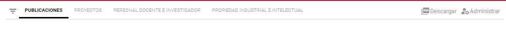


Y el botón que despliega las facetas.

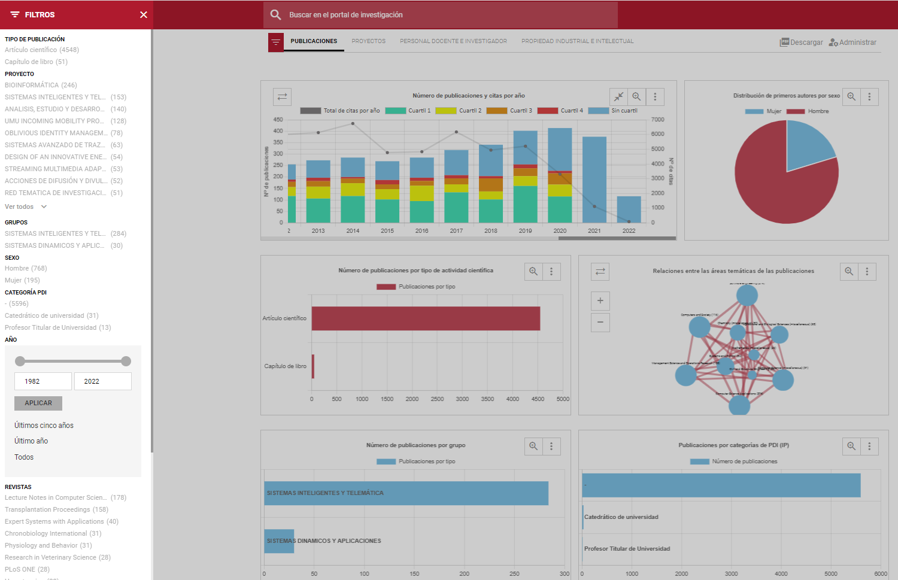

Las graficas a su vez tiene distintos botones para interactuar:

- Desplegable (arriba a la izquierda): Está opción únicamente se mostra cuando en la gráfica esté agregada la configuración de idGrupo. Dicha opción mostrará un listado de gráficas para poder seleccionar la que se quiera visualizar.

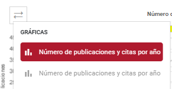


- Expandir/Contraer (arriba a la derecha): Aplica/disminuye la gráfica para la visualización de datos.

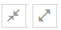


- Lupa (arriba a la derecha): Se abrirá un popup con la gráfica ampliada.

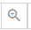


- Menú de acciones (arriba a la derecha):
  - Descargar JPG: Permite descargarse una imagen, en formtato JPG, de la gráfica completa.
  - Descargar CSV: Permite descargar los datos de la gráfica en formato CSV.
  - Guardar en mi panel: Permite al usuario guardarse la gráfica en ["Mis indicadores"](#indicadores-personales). 
  - Configuración: Abrirá un menú de configuracion de la gráfica para editar título, anchura de la gráfica y orden. Solo será visible a usuarios administradores en esta pestaña. 
  
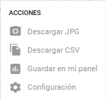


## Ejemplo de guardado de gráficas
Los usuarios tienen una opción en su menú, llamada "Mis indicadores", en la que pueden guardar gráficas para su espacio personal. 

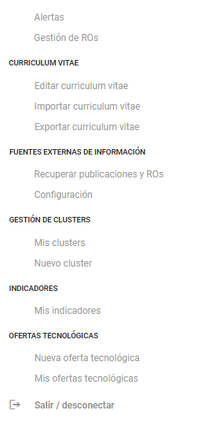

Para guardar una gráfica en el espacio personal hay que seguir los siguientes pasos:

- Situados en la página de Indicadores, pulsamos al botón de tres puntos de la gráfica a guardar y seleccionamos la opción de "Guardar en mi panel".

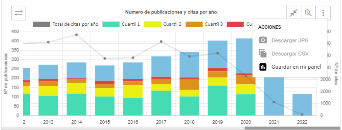

- Se nos abrirá un pop-up con una pequeña configuración de guardado:

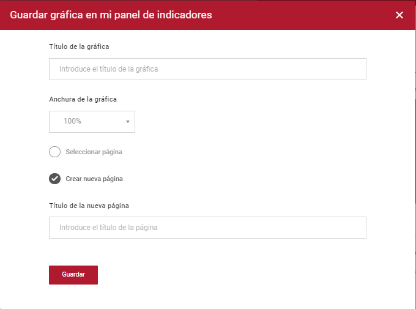

  - Título de la gráfica: Título el cual se va a guardar la gráfica.
  - Anchura: Porcentaje de anchura de la gráfica.
  - Seleccionar página / Crear nueva página: Página en la cual se guardará la gráfica. En el caso de que no se tenga páginas creadas, únicamente aparecerá la segunda opción "Crear nueva página".
  
Una vez pulsado el botón guardar, se nos habrá generado la gráfica en el menú de "Mis indicadores".
Si nos dirigimos allí, la veremos tal y como la hayamos guardado, es decir, con filtros incluidos. 
También se habrá creado la página si lo hemos seleccionado.
 
## Indicadores Personales
La sección de indicadores personales permite al usuario, la interacción con gráficas de una manera más personal. Pudiendo modificar algunos aspectos de la misma, como la escala de los ejes, la anchura, titulo y orden. Permitiendo incluso generar un informe personalizado con las gráficas.

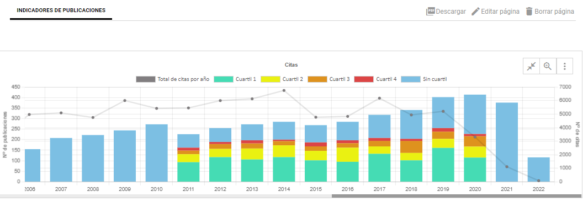

En el menú de la página se puede ver "Descargar", "Editar página" y "Borrar página".

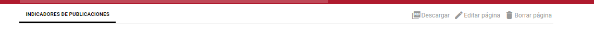

Al pulsar sobre "Descargar", se generará un archivo PDF presentando todas las gráficas de una manera limpia.

Si pulsamos sobre "Editar página" se abrirá un popup, en el cual podemos cambiar el título de la página y el orden de la misma.

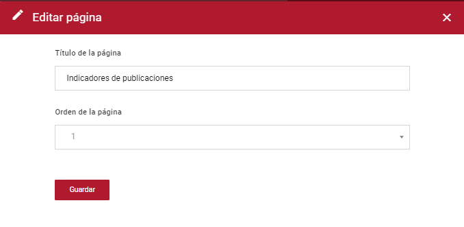

Pulsando "Borrar página" se nos mostrará un mensaje de borrado. Eliminando la página en el caso de aceptarlo.


En el apartado de las gráficas, si pulsamos el menú de acciones, representado por tres puntos, se abrirán opciones adicionales.

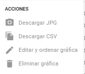

  - Descargar JPG - Descargará una imagen JPG de la gráfica.
 
  - Descargar CSV - Descargará un archivo CSV con los datos de la gráfica.
 
  - Editar y ordenar gráfica - Abrirá un popup con las siguientes opciones de edición:
    - Título de la gráfica: Permite modificar el título de la gráfica.
    - Anchura de la gráfica: Permite cambiar el ancho de la gráfica.
    - Orden de la gráfica: Mueve la gráfica a la posición seleccionada.
    - Escala del eje primario: Establece la altura maxima del eje primario.
    - Escala del eje secundario: Establece la altura maxima del eje secundario.
  
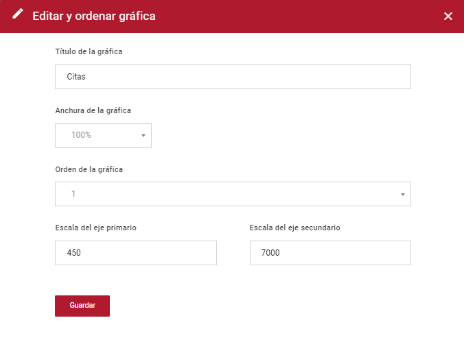
  
  
  - Eliminar gráfica - Abrirá un popup, similar al de "Borrar página", para confirmar el borrado de la gráfica.
  
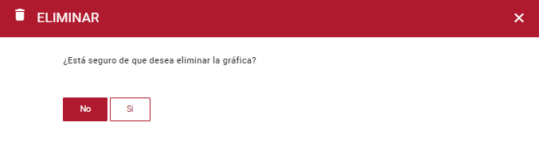


## Configuración en el appsettings.json

```json
{
  "Logging": {
    "LogLevel": {
      "Default": "Information",
      "Microsoft": "Warning",
      "Microsoft.Hosting.Lifetime": "Information"
    }
  },
  "AllowedHosts": "*",
  "LogPath": ""
}
```
- Logging: Nivel de almacenamiento de logs.
- LogPath: Ruta dónde se van a almacenar los logs.

## Dependencias

- GnossApiWrapper.NetCore: v1.0.8
- Newtonsoft.Json: 13.0.1
- Swashbuckle.AspNetCore: v6.2.4


